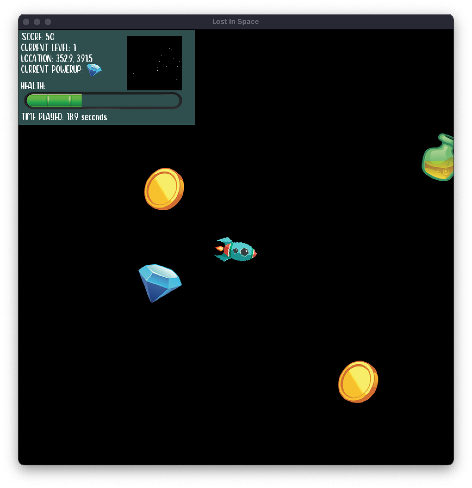
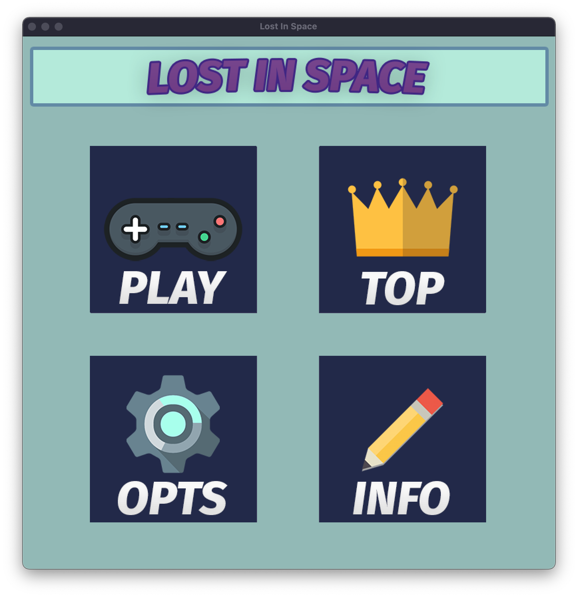
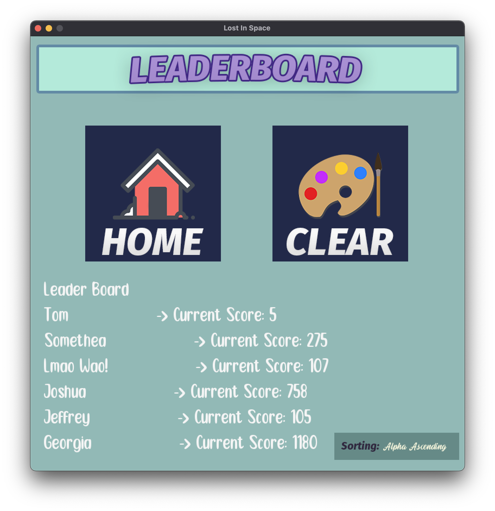

# Space Game 
## Description
Lost in Space is a Space Game created for Introduction to Programming at Deakin University

<table>
    <tr>
        <td>Gameplay</td>
        <td>Home</td>
        <td>Leaderboard</td>
    </tr>
    <tr>
        <td>
            
        </td>
        <td>
            
        </td>
        <td>
            
        </td>
    </tr>
</table>

## Features
The following features include:
<br />
- 💙 Music Player
- 💜 Leaderboards
- 💚 Enemies
- 💛 Menu Screens
- ❤️ Cross-Platform Support

## Installation

Space Game requires [SplashKit](https://www.splashkit.io/) and [MSYS2](https://www.msys2.org/) to run.

Install the dependencies and and fork the repository. Once complete, navigate to the folder and enter the following commands into the msys2 Terminal.

### Setup
```sh
./LostInSpace setup # Compile and Setup the Application
./LostInSpace.exe # Run the Application
```

## Progression
This project was created for University. Therefore, the application will be discontinued after finishing the Introduction to Programming unit.

## License
Permission to use, copy, modify, and/or distribute this software for any purpose with or without fee is hereby granted, provided that the above copyright notice and this permission notice appear in all copies.

THE SOFTWARE IS PROVIDED "AS IS" AND THE AUTHOR DISCLAIMS ALL WARRANTIES WITH REGARD TO THIS SOFTWARE INCLUDING ALL IMPLIED WARRANTIES OF MERCHANTABILITY AND FITNESS. IN NO EVENT SHALL THE AUTHOR BE LIABLE FOR ANY SPECIAL, DIRECT, INDIRECT, OR CONSEQUENTIAL DAMAGES OR ANY DAMAGES WHATSOEVER RESULTING FROM LOSS OF USE, DATA OR PROFITS, WHETHER IN AN ACTION OF CONTRACT, NEGLIGENCE OR OTHER TORTIOUS ACTION, ARISING OUT OF OR IN CONNECTION WITH THE USE OR PERFORMANCE OF THIS SOFTWARE.

## Future Features
+ With the levels - add planets, and more planets spawn the greater the level
+ Have a stay clear message,
+ Paused Menu hooked into the Settings Menu - to allow muting and changing of the volume
+ A shooting powerup
+ Only allow the user to change speeds when they have certain things, and make them slow down depending on the fuel
+ Different Worlds
+ When the user clicks Play give them an option of level and difficulty
+ Space Leader - Laser
+ Planet
+ Dying Sun

## CURRENTLY IMPLEMENTING
+ This Project is Depricated and Will Not Receive Future Updates.